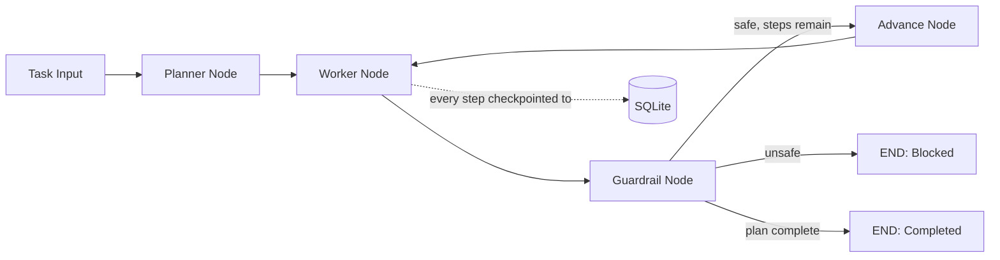

# Aegis Agent DAG


Resilient multi-agent orchestration system built with LangGraph — featuring real SQLite-backed state checkpointing (genuine crash recovery, not simulated) and dynamic safety guardrails between agent steps.

## Why this exists

Most "multi-agent" demo repos lose all progress if the process restarts. This one doesn't — every checkpoint is written to disk, and a fresh process can resume exactly where a crashed one left off. This is verified by an actual test that closes the connection and reopens it in a new graph instance.

## Architecture



## Core Components

- **Planner** — breaks a task into a sequence of steps.
- **Worker** — executes the current step.
- **Guardrail** — inspects worker output for unsafe patterns (keyword-based heuristic, same honest-baseline approach used in [sentinel-eval-gateway](https://github.com/sisodiyaanand/sentinel-eval-gateway)) and can halt the pipeline.
- **SQLite Checkpointer** — LangGraph's `SqliteSaver`, persisting the full state after every node so any thread can be resumed after a restart.

## Verified: Crash Recovery Actually Works

The test below is not a mock — it builds a graph, runs a task to completion, **closes the database connection** (simulating a crash), then builds a **brand-new graph instance** pointing at the same file and thread ID, and confirms the full history is still there:

```
tests/unit/test_recovery.py::test_state_persists_across_separate_graph_instances PASSED
tests/unit/test_recovery.py::test_different_thread_ids_have_independent_state PASSED
```

## Verified: Guardrail Actually Blocks Unsafe Output

```
tests/unit/test_guardrail.py::test_safe_output_passes PASSED
tests/unit/test_guardrail.py::test_unsafe_output_is_flagged PASSED
tests/unit/test_guardrail.py::test_empty_output_is_safe PASSED
tests/unit/test_guardrail.py::test_guardrail_node_blocks_status_on_unsafe_output PASSED
tests/unit/test_guardrail.py::test_guardrail_node_allows_safe_output PASSED
```

**7/7 tests passing** across both suites.

## Tech Stack

- **Orchestration:** LangGraph (`StateGraph`, conditional routing)
- **Persistence:** SQLite via `langgraph-checkpoint-sqlite`
- **Guardrails:** keyword-based safety heuristic (upgradeable to a trained classifier)
- **Testing:** Pytest

## Setup (Windows)

```cmd
python -m venv venv
venv\Scripts\activate
pip install -r requirements.txt
python -m src.main
```

## Run Tests

```cmd
pytest tests/unit -v
```

## Roadmap

- [ ] Swap SQLite for Redis-backed checkpointing in production config
- [ ] Replace rule-based planner/worker with real LLM calls
- [ ] Plug in the trained toxicity/bias classifier from `sentinel-eval-gateway` as the guardrail model
- [ ] Add a `/resume` CLI command to explicitly resume a blocked or interrupted thread

## Author

Anand Sisodiya — [GitHub](https://github.com/sisodiyaanand)
